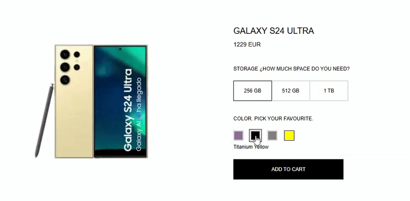
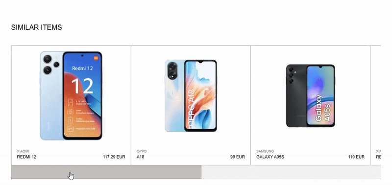

# MBST, a Zara challenge by Luis Garrido


## Getting Started

The app it's deployed at Vercel: [mbst.vercel.app](https://mbst.vercel.app)

## Local development mode ( localhost:3000 )
```bash
# first
npm install
# and then run
npm run dev   # next dev --turbopack
```

Open [http://localhost:3000](http://localhost:3000) with your browser to see the result.

## Local production mode ( localhost:4000 )
```bash
# first
npm install
# and then run
npm run start   # npm run build && next start
```

Open [http://localhost:4000](http://localhost:4000) with your browser to see the result.

## Test and linter
```bash
# to run tests
npm run test    # vitest
# to lint
npm run lint    # next lint
```


---

## The project

🌍 Online here : [mbst.vercel.app](https://mbst.vercel.app)

🏗️ I built a webapp following the designs of the [Figma project](https://www.figma.com/design/Nuic7ePgOfUQ0hcBrUUQrb/Labs-%252F-Zara-Web-Challenge-(Smartphones)?node-id=0-1&t=70pTEDeKhVCCV25p-1) and replicating some animations found on the [Figma Prototype](https://www.figma.com/proto/Nuic7ePgOfUQ0hcBrUUQrb/Labs-%2F-Zara-Web-Challenge-(Smartphones)?page-id=1%3A121&node-id=20620-406&node-type=canvas&viewport=-127%2C-2609%2C0.17&t=kBCv81QvTf1Tbzjs-1&scaling=min-zoom&content-scaling=fixed&starting-point-node-id=20620%3A1497&show-proto-sidebar=1).<br/><br/>
🕹️ A user that arrives to the `home page` can search by brand or model, the search input has a `debounced trigger` to search without having to press Enter key. Also a custom icon has been added to clear the search input field.<br/><br/>
👆 If clicks on a phone, it takes the user to `detail page`. If capacity and color has been selected the product can be added to the cart. Also on the detail page at the bottom the user can see `similar products` to navigate to other detail pages.<br/><br/>
🛒 At the `cart page` we can see all the products added to the cart. There is no limit, but the user can not add the same product twice. (no counter appears on the design so I guessed that feature). The user can remove any products here. Or continue shopping.<br/><br/>
💎 The cart is stored on `localStorage` so the user can keep the cart on different shopping sessions.

🦾 The page is fully responsive and easy to interact to with keyboard only ⌨️.

---
---
## Project Structure

Inside `/src` folder we can see the structure of the project.


### ⚛️ /app
The different pages (home, detail, and cart) are here.<br/>
It's built with NextJS 15, implementing its SSR features (server side rendering), and using App Router.
It has React 19 under the hood, so I added both server and client components.

---
### 🖼️ /components
A collection of components used on the webapp. From especific like the `slider` of similar products, to some that are reused like `card/product` or the `button/basic`.

---
### 🛠️ /contexts
Here we got the cart context, where it's stored the cart related state. It exports the Provider that wrap all the webapp, and also exports a custom hook to be called from different pages and components, providing the cart state but also the features to add to cart, remove from cart, and get cart.

---
### 🧩 /domain
Added hexagonal architecture (DDD!) for the different uses cases, that can be imported dynamically as required by the webapp. Two contexts implemented: cart and products.

Cart for `add to cart`, `remove from cart`, and `get cart` items. Here I added use case and repository layer, and I created an entity (cart item) and a value object (list of cart item entities). The repository is getting and storing data on local storage.

Products for `get products` and `get product detail`, also use case and repository layer, but here also added a fetcher as a domain object, and the repository communicates with the backend endpoints.

---
### 🪝 /hooks
Only a custom hook added: `useDebounce` to debounce the search input value, to prevent doing massive number of petitions to the API.

---
### 🧪 /tests
`Vitest` to make different integration tests of every use case. The endpoint calls has been mocked using `Mock Service Worker` (`MSW`). Also, combined `Vitest`with `Testing Library`🐙 to test Header, Layout Container, and Button Basic components.

---
### 💅 /theme
Here we can find a collection of theme tokens. The webapp has been styled with CSS modules.

---
---
## Others
### 🔍 ESlint, 📐 Stylelint and 😎 Prettier
Linting and formatting the entire project, JavaScript and CSS files, extended with some custom rules.

### 🐺 Husky
To run lint and tests before committing or pushing changes, and avoid adding changes that are breaking our webapp.

